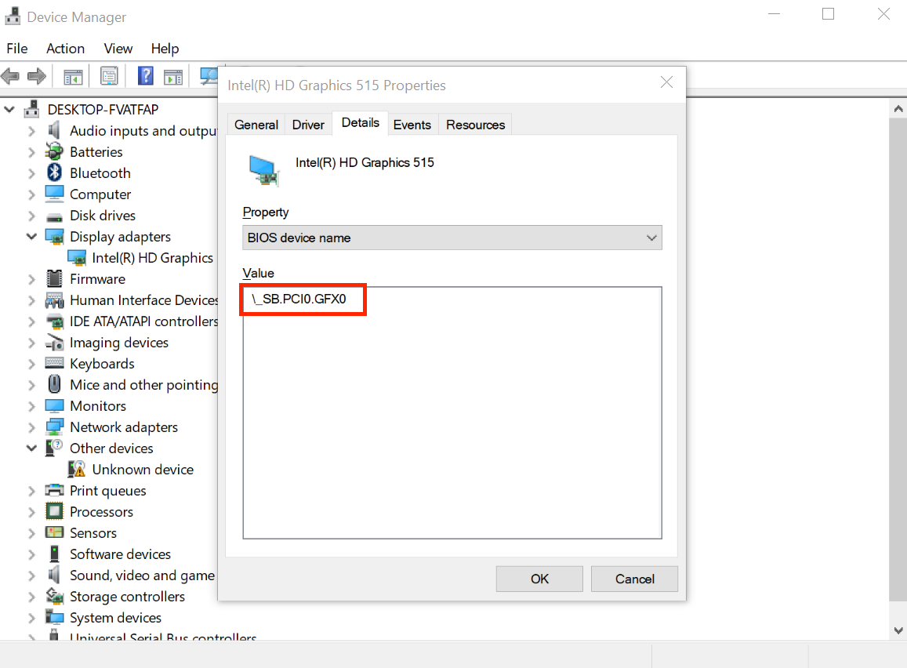
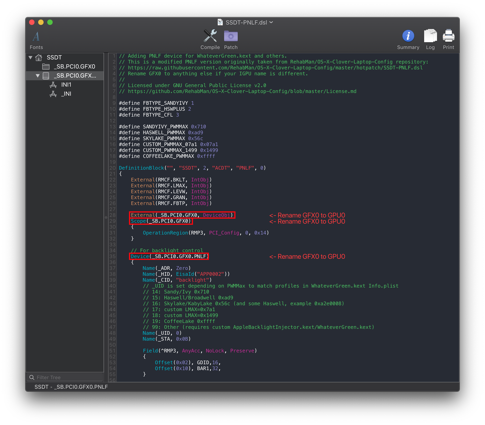
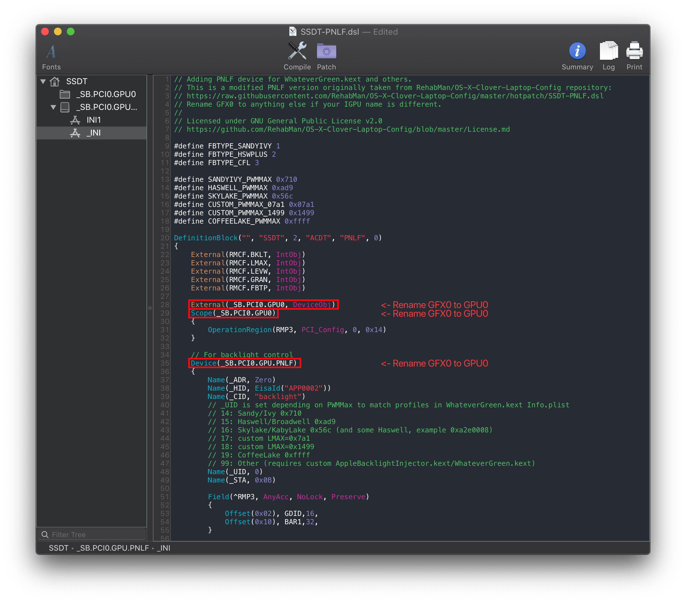

# Fixing Backlight (SSDT-PNLF)

[[toc]]

## What this SSDT does

The purpose of this SSDT is to create a PNLF device for macOS to play with, specifically one with a hardware ID of `APP0002`. Luckily WhateverGreen will handle the rest of the work for us.

## Methods to make this SSDT

For the backlight fix, there are 2 methods you can choose from:

* [Prebuilt](#prebuilt)
* [Manual](#manual)

### Prebuilt

By far the easiest method, all you need to do is download the following file:

* [SSDT-PNLF.aml](https://github.com/macos86/Getting-Started-With-ACPI/blob/master/extra-files/compiled/SSDT-PNLF.aml)
  * For most users
* [SSDT-PNLF-CFL.aml](https://github.com/macos86/Getting-Started-With-ACPI/blob/master/extra-files/compiled/SSDT-PNLF-CFL.aml)
  * For Coffee Lake and newer

Main things to note with this method:

* Assumes GPU pathing, works great for 99% of devices but if you're having issues controlling backlight this may be something to look at
* Doesn't really teach you anything
  * For most, this doesn't matter. But to some knowing what makes your hackintosh tick is part of the journey

### Manual

#### Finding the ACPI path

For this guide, we're gonna assume Windows is already on this laptop, as otherwise creating this SSDT is a bit more difficult.

Now open DeviceManager, and head to the following:

`Device Manager -> Display Adapters -> Properties -> Details > BIOS device name`

* Note some GPU ACPI pathing may be hiding under `BIOS device name`



From the above example, we can see our display is hooked up to `PCI0.GFX0`

#### Edits to the sample SSDT

Now that we have our ACPI path, lets grab our SSDT and get to work:

* [SSDT-PNLF.dsl](https://github.com/acidanthera/OpenCorePkg/tree/master/Docs/AcpiSamples/Source/SSDT-PNLF.dsl)
* [SSDT-PNLFCFL.dsl](https://github.com/acidanthera/OpenCorePkg/tree/master/Docs/AcpiSamples/Source/SSDT-PNLFCFL.dsl)
  * For Coffee Lake and newer

By default, this uses `PCI0.GFX0` for the pathing. you'll want to rename accordingly. For this example, we'll assume your pathing is `PCI0.GPU0`:

```c
External (_SB_.PCI0.GFX0, DeviceObj) <- Rename this

Scope (_SB.PCI0.GFX0) <- Rename this

Device(_SB.PCI0.GFX0.PNLF) <- Rename this
```



Following the example pathing we found, the SSDT should look something like this:

```c
External (_SB_.PCI0.GPU0, DeviceObj) <- Renamed

Scope (_SB.PCI0.GPU0) <- Renamed

Device(_SB.PCI0.GPU0.PNLF) <- Renamed
```



#### Compiling the SSDT

 With the SSDT done, you're now [ready to compile the SSDT!](/compile.md)

## Wrapping up

Once you're done making your SSDT, either head to the next page to finish the rest of the SSDTs or head here if you're ready to wrap up:

* [**Cleanup**](/cleanup.md)
