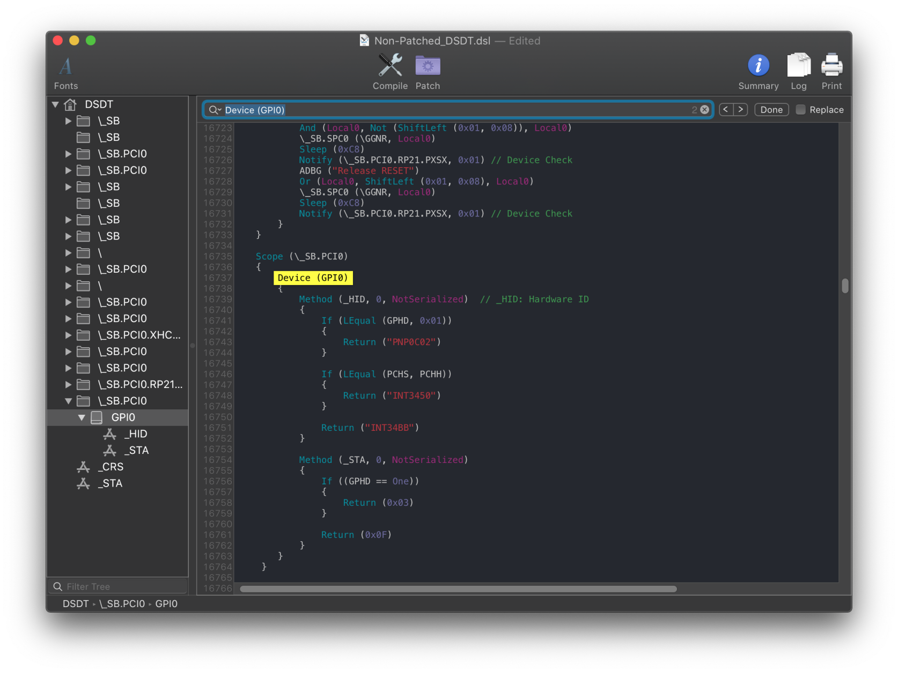
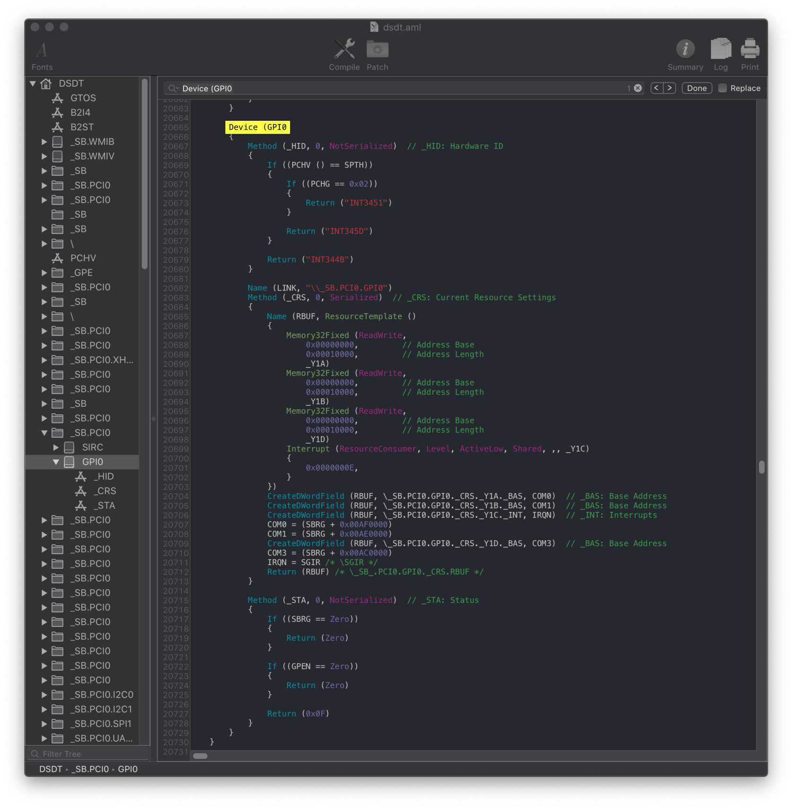
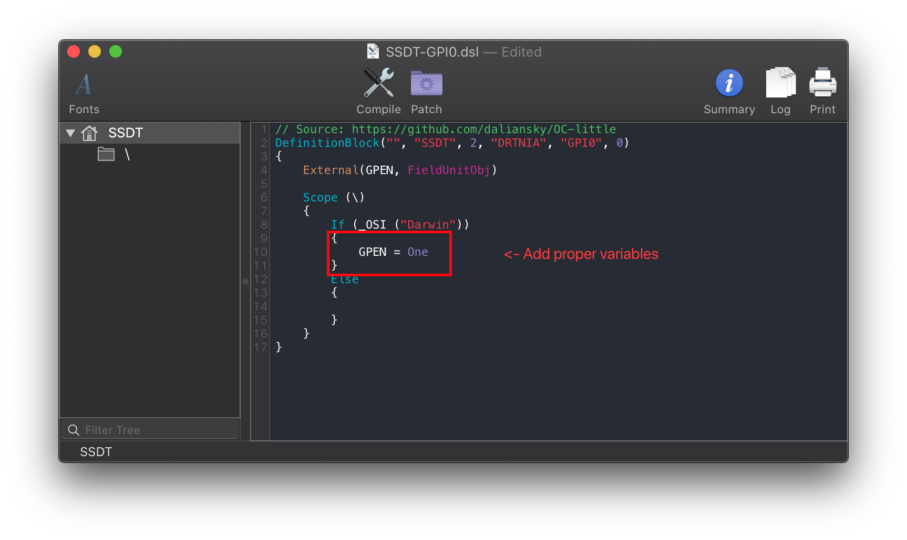
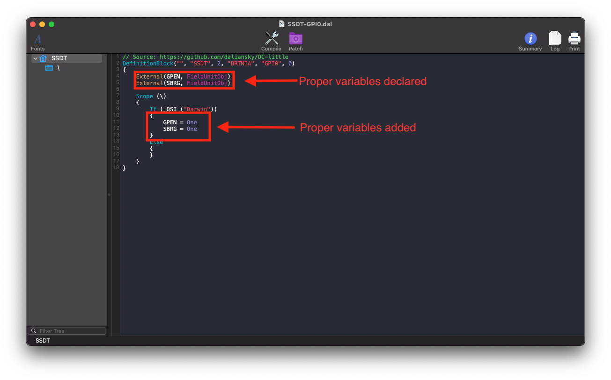

# Fixing Trackpads (SSDT-GPI0/XOSI)

[[toc]]

## What this SSDT does

This SSDT is used to force enable our GPI0 for VoodooI2C to connect onto.

With most modern laptop DSDTs, there's a variable called `GPEN` or `GPHD` which are used for setting the status of the GPI0 device. For us, we want to enable the device.

## Methods to make this SSDT

For the trackpad fix, there are 2 methods you can choose from:

* [Prebuilt](#prebuilt)
* [Manual](#manual)

### Prebuilt

This is a one-size fits all solution where we basically trick our hardware into thinking it's booting Windows. The problem with this method is that it's common to break Windows booting so avoid unless troubleshooting.

* [SSDT-XOSI](https://github.com/macos86/Getting-Started-With-ACPI/blob/master/extra-files/compiled/SSDT-XOSI.aml)

* XOSI Rename(add this under config.plist -> ACPI -> Patch):

| Comment | String | Change _OSI to XOSI |
| :--- | :--- | :--- |
| Enabled | Boolean | YES |
| Count | Number | 0 |
| Limit | Number | 0 |
| Find | Data | 5f4f5349 |
| Replace | Data | 584f5349 |

### Manual

#### Finding the ACPI path

Finding the ACPI pathing is quite easy actually, first open your decompiled DSDT you got from [Dumping the DSDT](/dump.md) and [Decompiling and Compiling](../compile.md) with either MaciASL(if in macOS) or any other text editor if in Windows or Linux(VSCode has an [ACPI extension](https://marketplace.visualstudio.com/items?itemName=Thog.vscode-asl) that can also help).

Next search for `Device (GPI0)`. Should give you a result similar to this:



What we care about from this is the `_STA` method:

```
Method (_STA, 0, NotSerialized)
{
    If ((GPHD == One))
    {
        Return (0x03)
    }

    Return (0x0F)
}
```

What we want is for this to always return `0x0F` when booting macOS, so we want to make an SSDT that will return `GPHD == Zero` in macOS.

**NOTE that you may have the other way around where GPHD needs to be set as `One` to return `0x0F`**. And your device name may also be different, don't throw random SSDTs in thinking it'll work

Here's some more examples:



With this example, we can see that we need both `SBRG` and `GPEN` to return `One`. If only one is present, it'll create some issues so in our SSDT we'll want to have both of them return `One`:

#### Edits to the sample SSDT

Now that we have our ACPI path, lets grab our SSDT and get to work:

* [SSDT-GPI0.dsl](https://github.com/macos86/Getting-Started-With-ACPI/blob/master/extra-files/decompiled/SSDT-GPI0.dsl)

From the second example, we'll want to set both GPEN and SBRG to `One` to allow it to operate in macOS:

```
If (_OSI ("Darwin"))
{
    GPEN = One <- Proper variables
}
```



Following the example pathing we found, the SSDT should look something like this:

```

External(GPEN, FieldUnitObj) <- Declare the right variables
External(SBRG, FieldUnitObj) <- Declare the right variables

Scope (\)
{
    If (_OSI ("Darwin"))
    {
        GPEN = One <- Change to the right variables
        SBRG = One <- Change to the right variables
    }
```



#### Compiling the SSDT

 With the SSDT done, you're now [ready to compile the SSDT!](../compile.md)

## Wrapping up

Once you're done making your SSDT, either head to the next page to finish the rest of the SSDTs or head here if you're ready to wrap up:

* [**Cleanup**](../cleanup.md)
