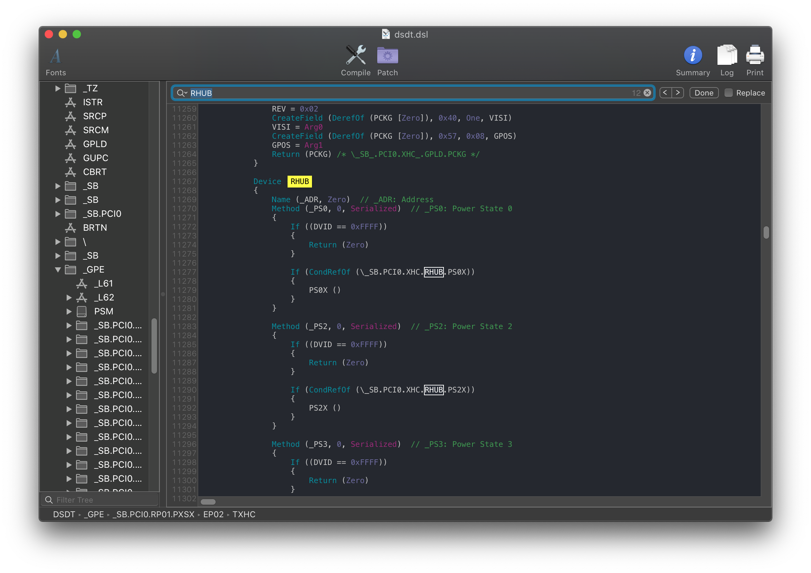
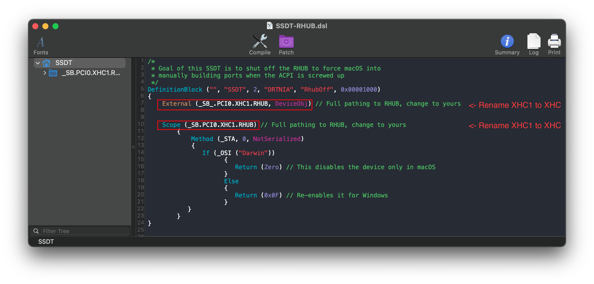

# Fixing USB: Manual

[[toc]]

## Finding the ACPI path

Finding the ACPI pathing is quite easy actually, first open your decompiled DSDT you got from [Dumping the DSDT](/dump.md) and [Decompiling and Compiling](/compile.md) with either MaciASL(if in macOS) or any other text editor if in Windows or Linux(VSCode has an [ACPI extension](https://marketplace.visualstudio.com/items?itemName=Thog.vscode-asl) that can also help).

Next, search for the `Device (RHUB)`

You should get something like the following show up:



From the above, we can see that the full ACPI pathing for RHUB is `PCI0.XHC.RHUB`. If it's not as clear you can search for what those device paths are for your system:

* Finding the PCI path:
  * Search `PNP0A08` (If multiple show up, use the first one)
* Finding XHCI path
  * Search for `XHC`, `XHCI` and `XHC1`, and yours is whichever shows up.

Now with the pathing, you can head here: [Edits to the sample SSDT](#edits-to-the-sample-ssdt)

## Edits to the sample SSDT

Now that we have our ACPI path, lets grab our SSDT and get to work:

* [SSDT-RHUB.dsl](https://github.com/macos86/Getting-Started-With-ACPI/blob/master/extra-files/decompiled/SSDT-RHUB.dsl)

By default, this uses `PCI0.XHC1.RHUB` for the pathing. you'll want to rename accordingly.

Following the example from above, we'll be renaming it to `PCI0.XHC.RHUB`:

**Before**:

```
External (_SB_.PCI0.XHC1.RHUB, DeviceObj) <- Rename this

Scope (_SB.PCI0.XHC1.RHUB) <- Rename this
```



Following the example pathing we found, the SSDT should look something like this:

**After**:

```
External (_SB.PCI0.XHC.RHUB, DeviceObj) <- Renamed

Scope (_SB.PCI0.XHC.RHUB) <- Renamed
```


## Compiling the SSDT

 With the SSDT done, you're now [ready to compile the SSDT!](/compile.md)

## Wrapping up

Once you're done making your SSDT, either head to the next page to finish the rest of the SSDTs or head here if you're ready to wrap up:

* [**Cleanup**](/cleanup.md)
