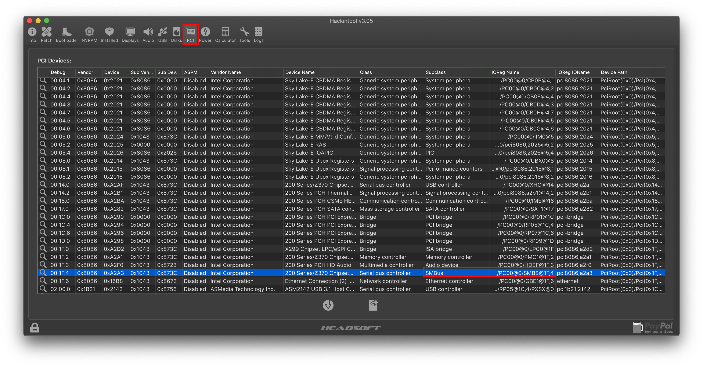
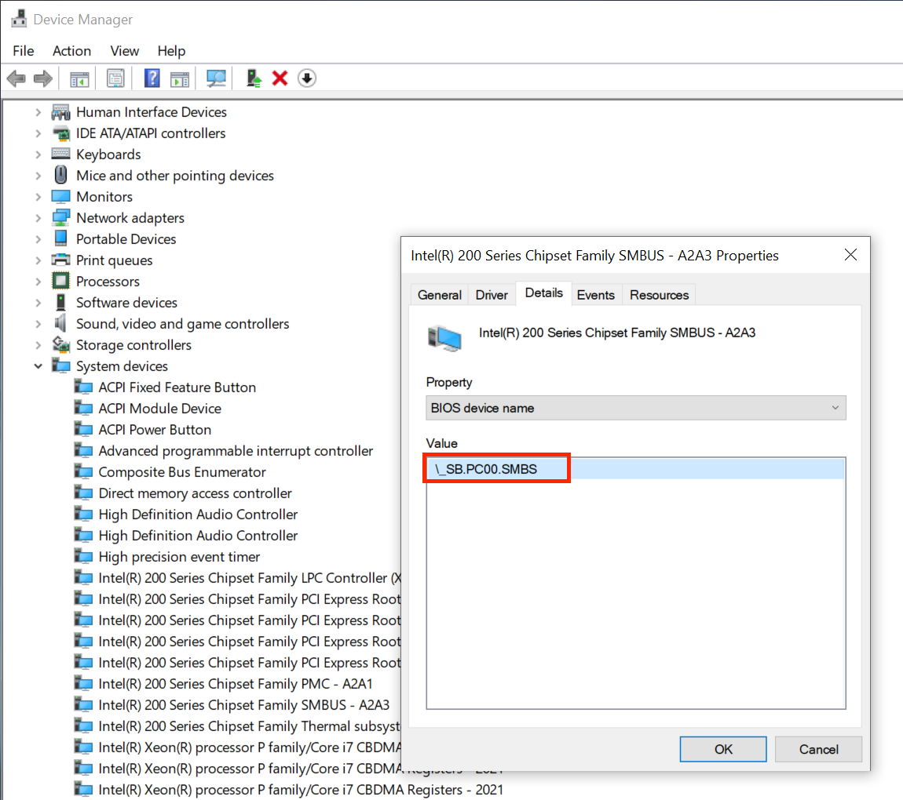
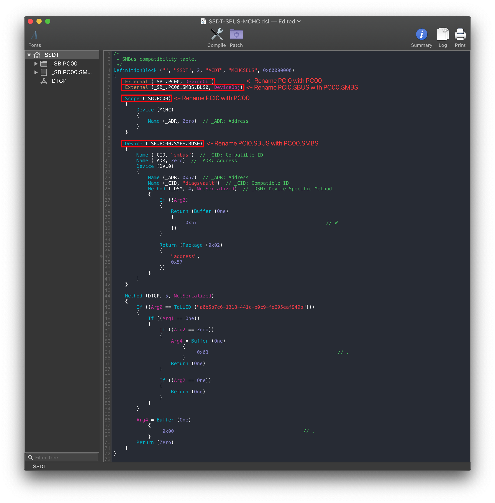
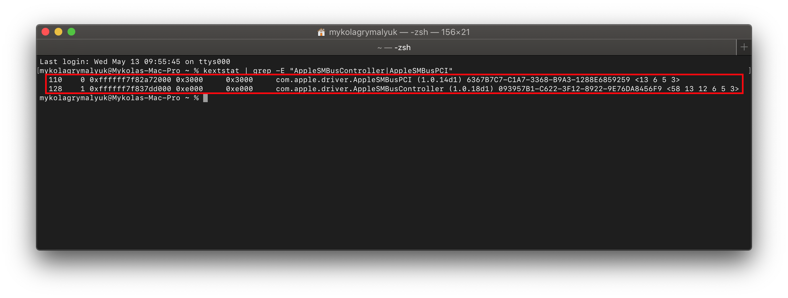

# Fixing SMBus support: Manual

[[toc]]

## Finding the ACPI path

So to find the ACPI pathing of our SMBus, we've got 2 methods:

* [Hackintool](#hackintool)
* [DeviceManager](#devicemanager)

### Hackintool

To find the correct pathing for your devices, grab [Hackintool](https://www.tonymacx86.com/threads/release-hackintool-v3-x-x.254559/) ([Github link](https://github.com/headkaze/Hackintool)) and head to the PCI tab:



Look for the SMBus device under Subclass, then look beside and you'll see the ACPI path(under IOReg Name). To convert , omit `@...`

* `/PC00@0/SMBS@1F,4` -> `PC00.SMBS`

With the ACPI pathing, you can now head here: [Edits to the sample SSDT](#edits-to-the-sample-ssdt)

### DeviceManager

If you already have Windows installed on this machine, finding the SMBus pathing is fairly easy.

Start by opening up Device Manager in Windows and looking for a device named `SMBUS`. Once found, click on it and select the `BIOS device Name` entry. You should get something like this:



From the above example, we can see the SMBus is located at:

```
PC00.SMBS
```

With the ACPI pathing, you can now head here: [Edits to the sample SSDT](#edits-to-the-sample-ssdt)

## Edits to the sample SSDT

Now that we know the ACPI pathing of the SMBus, we can finally start editing the our SSDT.

* [SSDT-SBUS-MCHC.dsl](https://github.com/acidanthera/OpenCorePkg/tree/master/Docs/AcpiSamples/Source/SSDT-SBUS-MCHC.dsl)

So the important parts we care about are:

**Before**:

```
External (_SB_.PCI0, DeviceObj) <- Rename this
External (_SB_.PCI0.SBUS.BUS0, DeviceObj) <- Rename this

Scope (_SB.PCI0) <- Rename this
{
    Device (MCHC)
    {
        Name (_ADR, Zero)  // _ADR: Address
    }
}

Device (_SB.PCI0.SBUS.BUS0) <- Rename this
```


Following the example SMBus pathing we found, the SSDT should look something like this:

**After**:

```
External (_SB_.PC00, DeviceObj) <- Renamed
External (_SB_.PC00.SMBS.BUS0, DeviceObj) <- Renamed

Scope (_SB.PC00) <- Renamed
{
    Device (MCHC)
    {
        Name (_ADR, Zero)  // _ADR: Address
    }
}

Device (_SB.PC00.SMBS.BUS0) <- Renamed
```



## Compiling the SSDT

 With the SSDT done, you're now [ready to compile the SSDT!](/compile.md)

## Wrapping up

Once you're done making your SSDT, either head to the next page to finish the rest of the SSDTs or head here if you're ready to wrap up:

* [**Cleanup**](/cleanup.md)

## Verify it's working

Once you've installed macOS, you can actually check whether your SSDT-SBUS-MCHC is working or not in terminal:

```
kextstat | grep -E "AppleSMBusController|AppleSMBusPCI"
```


