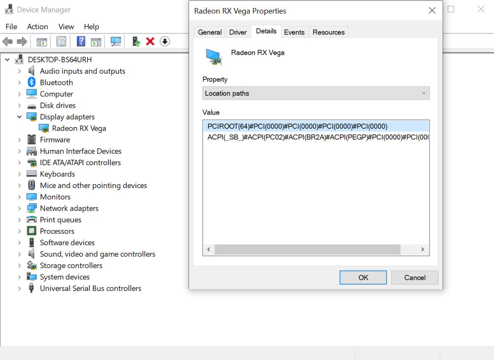

# Renaming GPUs (SSDT-GPU-SPOOF)

So this is mainly needed for GPUs that are not natively supported out of the box due to their names, most commonly:

* R9 290/390
* R9 280/380
* R7 270/370
* R9 260/360
* R7 250
* R7 240

Instead, these GPUs need to be "spoofed" or faked into a model that closely matches theirs, generally this will be the "X" variant of the card. For some reason Apple never bothered adding the PCI IDs for these other cards even though their GPU cores are supported by the driver.

So to spoof the GPU, we need to find a couple things:

* Suitable PCI ID for the GPU
* ACPI Path of the GPU
* [SSDT-GPU-SPOOF](https://github.com/macos86/Getting-Started-With-ACPI/blob/master/extra-files/decompiled/SSDT-GPU-SPOOF.dsl)

## Finding a suitable PCI ID

### Finding a suitable PCI ID in the Web

To find a suitable PCI ID, we'll be using [PCI ID Repository](https://pci-ids.ucw.cz/read/PC/1002) which has a full database of all AMD GPUs. For this example, we'll be creating a Spoof SSDT for the R9 390. For a full list of supported GPUs, please see the [GPU Buyers Guide](https://dortania.github.io/GPU-Buyers-Guide/). The closest match to this GPU would be the 390X, and looking on that site near the top gives us this:

```
Vendor 1002 -> Device 1002:67b0
```

Now lets break this down into a device ID we can use:

* `1002`: The vendor ID, all AMD devices have this ID
* `67B0`: The device ID, this is what we care about

So how do we convert this to a fake ID? Well the format of a fake ID:

```c
"device-id",
Buffer (0x04)
{
     0xB0, 0x67, 0x00, 0x00
},
```

As you can see, the bytes are swapped in pairs. Keep this in mind when we make our SSDT

The specifics are due to [Endianness](https://en.wikipedia.org/wiki/Endianness) for those who are curious

### Finding a suitable PCI ID in Linux

If you can run Linux, use command `lspci -vmmnnD -d 1002::0300`

```
$ lspci -vmmnnD -d 1002::0300
Slot: 0000:01:00.0
Class: VGA compatible controller [0300]
Vendor: Advanced Micro Devices, Inc. [AMD/ATI] [1002]
Device: Oland [Radeon HD 8570 / R7 240/340 / Radeon 520 OEM] [6611]
SVendor: Micro-Star International Co., Ltd. [MSI] [1462]
SDevice: Device [3740]
Rev: 87
```

You can easily get

* Slot ID `0000:01:00.0`, we need it later
* Vendor ID `1002`, all AMD devices have this ID
* Device ID `6611`, this is what we care about
* Device name `Radeon HD 8570 / R7 240/340 / Radeon 520 OEM`, mainly cosmetic

## Finding the ACPI Path of the GPU

### Windows

To find the PCI path of a GPU is fairly simple, best way to find it is running Windows:

* Open Device Manager
* Select Display Adapters, then right click your GPU and select Properties
* Under the Details Tab, search for "Location Paths"
  * Note some GPUs may be hiding under "BIOS device name"




The second "ACPI" is what we care about:

```
ACPI(_SB_)#ACPI(PC02)#ACPI(BR2A)#ACPI(PEGP)#PCI(0000)#PCI(0000)
```

Now converting this to an ACPI path is quite simple, remove the `#ACPI` and `#PCI(0000)`:

```
\_SB_.PC02.BR2A.PEGP
```

### Linux

Substitute your SLOTID found above into command `cat /sys/bus/pci/devices/SLOTID/firmware_node/path`, you cat get

```bash
$ cat /sys/bus/pci/devices/0000:01:00.0/firmware_node/path
\_SB_.PC02.BR2A.PEGP
```

And voila! We've found our ACPI path, now that we have everything we're ready to get cooking

## Making the SSDT

To start grab our [SSDT-GPU-SPOOF](https://github.com/macos86/Getting-Started-With-ACPI/blob/master/extra-files/decompiled/SSDT-GPU-SPOOF.dsl) and open it up. Here there's a couple things to change:

```
External (_SB_.PCI0, DeviceObj)
External (_SB_.PCI0.PEG0.PEGP, DeviceObj)
```

For our example, we'll change all mentions of :

* `PCI0` with `PC02`
* `PEG0` with `BR2A`

Hint: If your ACPI path is a bit shorter than the example, this is fine. Just make sure the ACPI paths are correct to your device.

Now that the ACPI pathing is correct, we can finally apply our fake ID!!!

So the 2 parts we want to change:

**device ID**:

```c
"device-id",
Buffer (0x04)
{
    0xB0, 0x67, 0x00, 0x00
},
```

**Model**:

```c
"model",
Buffer ()
{
    "AMD Radeon R9 390"
}
```

`"device-id"` will be set to our PCI ID that we found in "Finding a suitable PCI ID" and `"model"` is mainly cosmetic

## [Now you're ready to compile the SSDT!](/compile.md)
